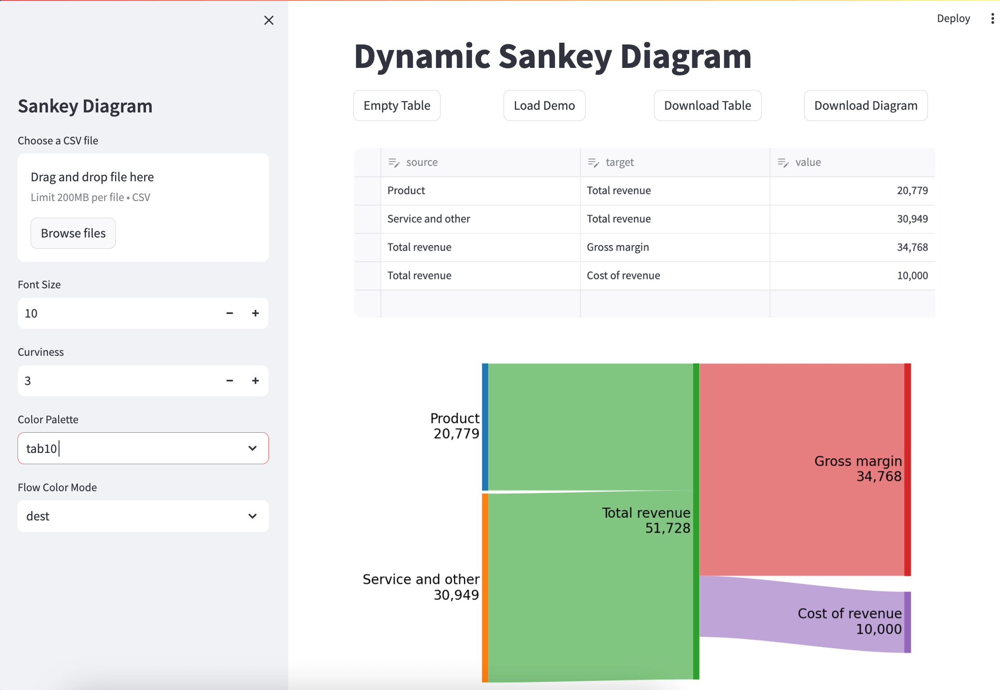

# sankey-streamlit

A Streamlit app to generate Sankey diagrams.

## Contributing

Developing

- Run `poe` from within the development environment to print a list of [Poe the Poet](https://github.com/nat-n/poethepoet) tasks available to run on this project.
- Run `poetry add {package}` from within the development environment to install a run time dependency and add it to `pyproject.toml` and `poetry.lock`. Add `--group test` or `--group dev` to install a CI or development dependency, respectively.
- Run `poetry update` from within the development environment to upgrade all dependencies to the latest versions allowed by `pyproject.toml`.

